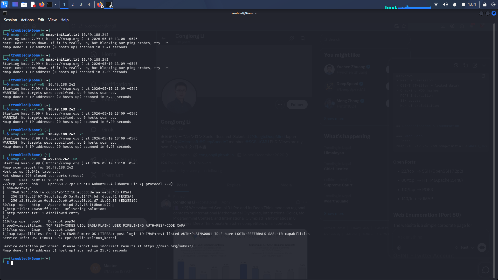
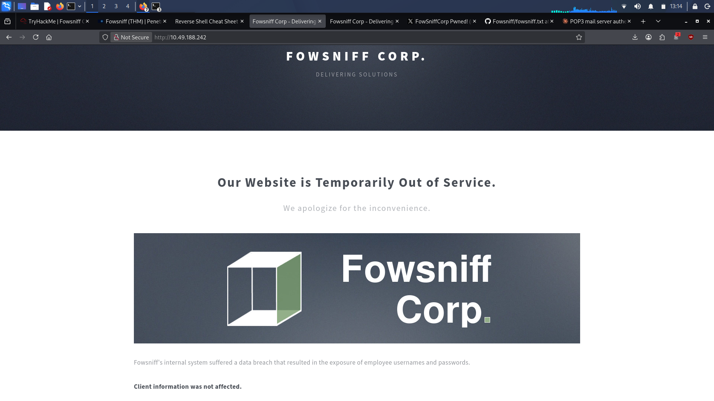
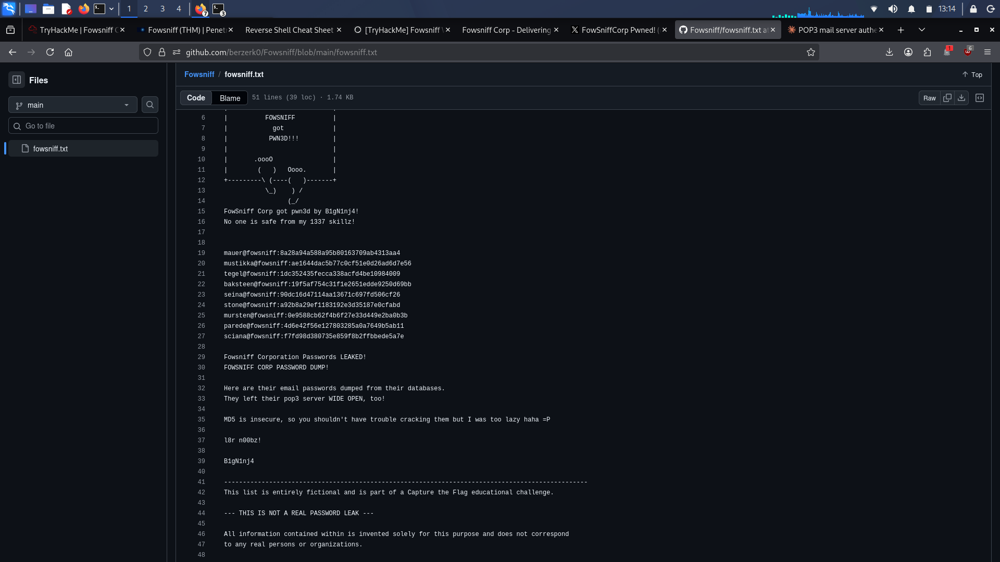
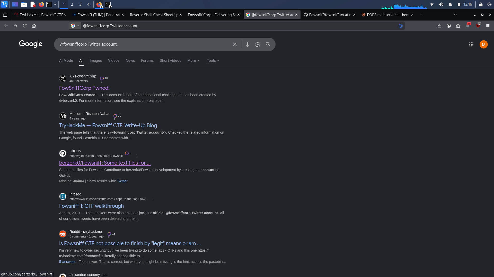
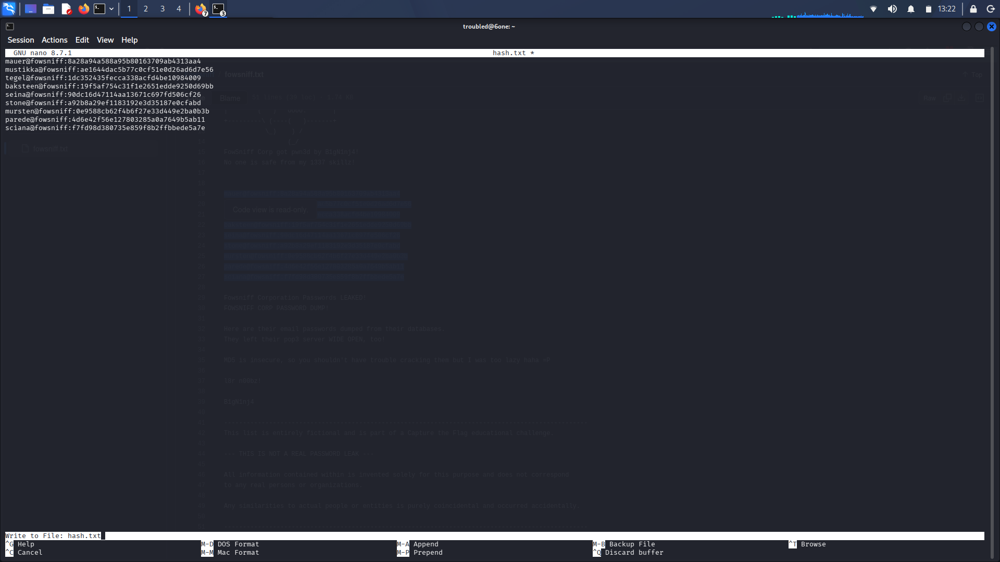
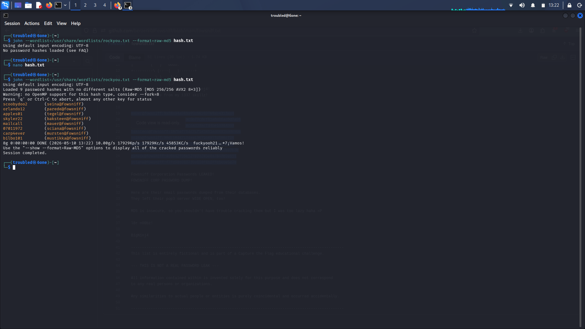
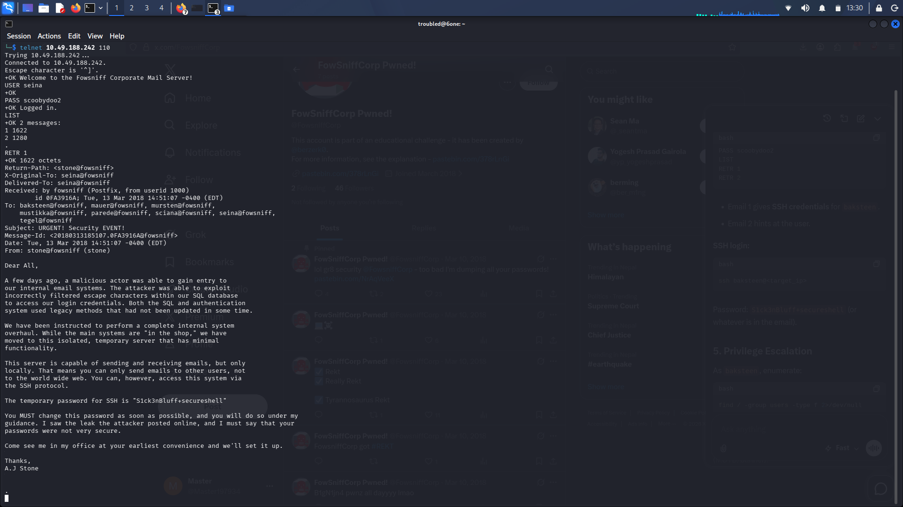
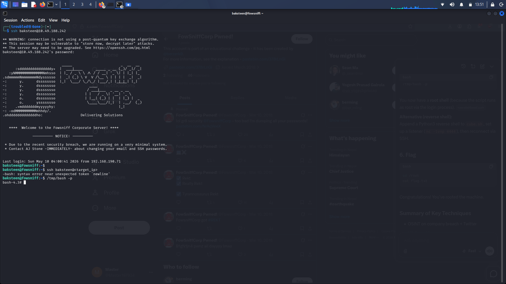

# Fowsniff - TryHackMe Writeup

**Author:** [P1st0ler0](https://tryhackme.com/p/P1st0ler0)  
**Platform:** TryHackMe  
**Room:** [Fowsniff](https://tryhackme.com/room/fowsniff)  
**Difficulty:** Easy  
**Date:** May 10, 2026

---

## Objective
Exploit a data breach at Fowsniff Corporation to gain initial access and escalate to root.

---

## Reconnaissance

### Nmap Scan

### Web Enumeration

---

## OSINT - Credential Leak

### GitHub Leak

### Twitter OSINT

---

## Password Cracking

**Cracked Credentials (redacted):**
- `seina` → `scooby*****`
- `baksteen` → `S1ck3nBluff********`

---

## Initial Access via POP3

---

## SSH Access

---

## Privilege Escalation & Root

After successful privilege escalation, we gained a **root shell**:

**Flag Captured!**

---

**Writeup by:** [P1st0ler0](https://tryhackme.com/p/P1st0ler0)
